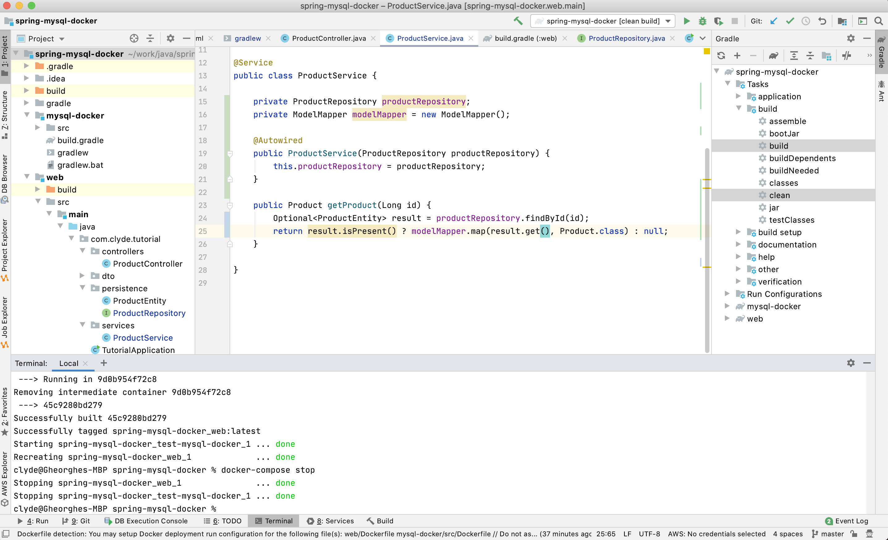

# spring mysql docker project

###Purpose
The purpose of this project is to give an idea how you ca develop a spring boot application
with a database but without installing on it on the local machine.

### Prerequisite 
A version of docker installed locally and functional
Knowledge of java and gradle

First step is to build the application from Gradle window

just press gradle button and select clean build
from terminal 

docker-compose up --build -d

for stop in terminal

docker-compose stop

testing url

http://localhost:8181/product/4

